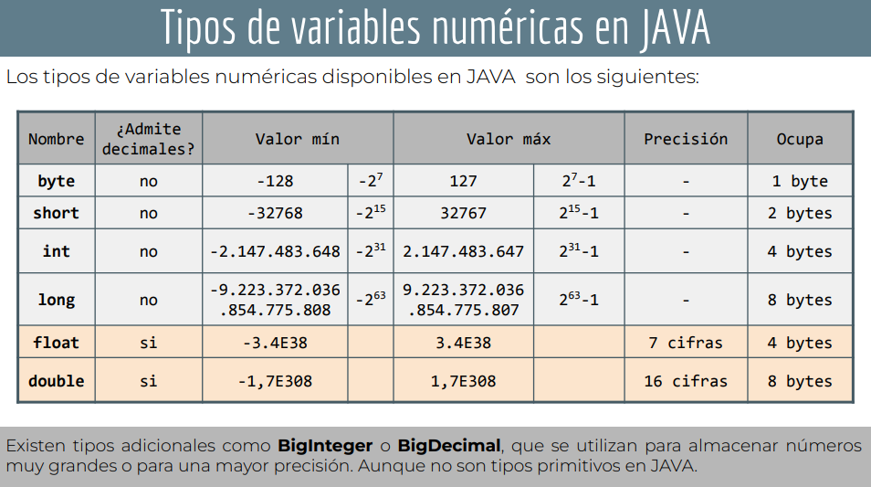

### Tipos de datos

En JAVA existen varios tipos de tipos de datos. Comencemos con los más comunes. Los diferentes tipos de datos se cubrirán en detalle en otras secciones. Por el momento, repasemos los diferentes tipos de datos y familiaricémonos con ellos.

#### Numericos

- byte: byte admite 8 bits
- short: short admite 16 bits
- Int: Int admite 32 bits
- Long: Long admite 64 bits
- Float: Float admite 4 bits Decimal number
- Double: Double admite 8 bits Decimal number

#### Cadena

- char: char almacena un unico caracter.
- String: String almacena un conjunto de caracteres.

#### Booleans

Un tipo de datos booleano es un valor Verdadero o Falso.

- Boolean