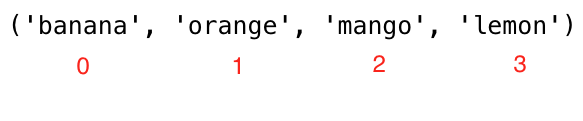

## Tuplas en Python

Una tupla es una colección de diferentes tipos de datos ordenados e inmutables. Las tuplas se escriben con corchetes, (). Una vez creada una tupla, no podemos cambiar sus valores. No podemos utilizar los métodos add, insert, remove en una tupla porque no es modificable (mutable). A diferencia de las listas, las tuplas tienen pocos métodos. Métodos relacionados con las tuplas:

tuple(): para crear una tupla vacía
count(): para contar el número de un elemento especificado en una tupla
index(): para encontrar el índice de un elemento especificado en una tupla
operator: para unir dos o más tuplas y crear una nueva tupla.

### Como crear una tupla

Creando una tupla con valores vacios:
```py
# syntax
empty_tuple = ()
# or using the tuple constructor
empty_tuple = tuple()
```
- Tupla con valores iniciales
  
  ```py
  # syntax
  tpl = ('item1', 'item2','item3')
  ```

  ```py
  fruits = ('banana', 'orange', 'mango', 'lemon')
  ```

### Tamaño de la tupla

Nosotros usamos la funcion _len()_ para obtener el tamaño de la tupla.

```py
# syntax
tpl = ('item1', 'item2', 'item3')
len(tpl)
```

### Accediendo a los elementos de la tupla

- Indices positivos 
  De forma similar al tipo de datos lista, utilizamos la indexación positiva o negativa para acceder a los elementos de la tupla.
  

  ```py
  # Syntax
  tpl = ('item1', 'item2', 'item3')
  first_item = tpl[0]
  second_item = tpl[1]
  ```

  ```py
  fruits = ('banana', 'orange', 'mango', 'lemon')
  first_fruit = fruits[0]
  second_fruit = fruits[1]
  last_index =len(fruits) - 1
  last_fruit = fruits[las_index]
  ```

- Indices negativos 
  La indexación negativa significa que empezando por el final, -1 se refiere al último elemento, -2 al penúltimo y el negativo de la longitud de la lista/tupla se refiere al primer elemento.
  

  ```py
  # Syntax
  tpl = ('item1', 'item2', 'item3','item4')
  first_item = tpl[-4]
  second_item = tpl[-3]
  ```

  ```py
  fruits = ('banana', 'orange', 'mango', 'lemon')
  first_fruit = fruits[-4]
  second_fruit = fruits[-3]
  last_fruit = fruits[-1]
  ```

### Cortar tuplas

Podemos trocear una sub-tupla especificando un rango de índices donde empezar y donde terminar en la tupla, el valor de retorno será una nueva tupla con los elementos especificados.

- Rango de indices positivos

  ```py
  # Syntax
  tpl = ('item1', 'item2', 'item3','item4')
  all_items = tpl[0:4]         # all items
  all_items = tpl[0:]         # all items
  middle_two_items = tpl[1:3]  # does not include item at index 3
  ```

  ```py
  fruits = ('banana', 'orange', 'mango', 'lemon')
  all_fruits = fruits[0:4]    # all items
  all_fruits= fruits[0:]      # all items
  orange_mango = fruits[1:3]  # doesn't include item at index 3
  orange_to_the_rest = fruits[1:]
  ```

- Rango de indices negativos

  ```py
  # Syntax
  tpl = ('item1', 'item2', 'item3','item4')
  all_items = tpl[-4:]         # all items
  middle_two_items = tpl[-3:-1]  # does not include item at index 3 (-1)
  ```

  ```py
  fruits = ('banana', 'orange', 'mango', 'lemon')
  all_fruits = fruits[-4:]    # all items
  orange_mango = fruits[-3:-1]  # doesn't include item at index 3
  orange_to_the_rest = fruits[-3:]
  ```

### Cambiando una tupla a una lista

Podemos cambiar tuplas a listas y listas a tuplas. Tuple es inmutable si queremos modificar una tupla debemos cambiarla a lista.

```py
# Syntax
tpl = ('item1', 'item2', 'item3','item4')
lst = list(tpl)
```

```py
fruits = ('banana', 'orange', 'mango', 'lemon')
fruits = list(fruits)
fruits[0] = 'apple'
print(fruits)     # ['apple', 'orange', 'mango', 'lemon']
fruits = tuple(fruits)
print(fruits)     # ('apple', 'orange', 'mango', 'lemon')
```
### Comprobación de un elemento en una tupla

Podemos comprobar si un elemento existe o no en una tupla utilizando _in_, que devuelve un booleano.

```py
# Syntax
tpl = ('item1', 'item2', 'item3','item4')
'item2' in tpl # True
```

```py
fruits = ('banana', 'orange', 'mango', 'lemon')
print('orange' in fruits) # True
print('apple' in fruits) # False
fruits[0] = 'apple' # TypeError: 'tuple' object does not support item assignment
```

### Unir tuplas

Podemos unir dos o más tuplas utilizando el operador +.

```py
# syntax
tpl1 = ('item1', 'item2', 'item3')
tpl2 = ('item4', 'item5','item6')
tpl3 = tpl1 + tpl2
```

```py
fruits = ('banana', 'orange', 'mango', 'lemon')
vegetables = ('Tomato', 'Potato', 'Cabbage','Onion', 'Carrot')
fruits_and_vegetables = fruits + vegetables
```

### Borrar tuplas

No es posible eliminar un único elemento de una tupla, pero sí es posible eliminar la propia tupla utilizando _del_.

```py
# syntax
tpl1 = ('item1', 'item2', 'item3')
del tpl1

```

```py
fruits = ('banana', 'orange', 'mango', 'lemon')
del fruits
```