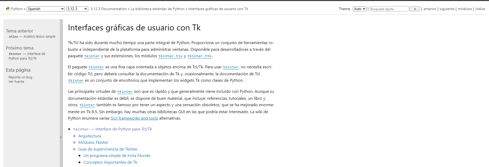

## TKINTER

Es una libreria para la creacion de GUI (Interfaz grafica de usuarios) por medio de la cual podemos construir aplicaciones de escritorio. Esta viene incluida en el paquete de instalacion de python, por lo cual no es necesario instalarla manualmente.

[](https://docs.python.org/es/3/library/tk.html)

### Creando la primera ventana 

Instalar prerequisitos para trabajar con imagenes, usamos la libreria Pillow

```console
pip install Pillow

```

```py
import tkinter as tk 
from PIL import Image, ImageTk # Requiere instalar Pillow 

ventana = tk.Tk()
#Agregando icono a la ventana
path = Image.open("D:\_EMPRESARIAL\_TECNAR\CLASES\PROGRAMACION\REPO\Clase8\PrimeraApp\imagenes\icono.png")
icono = ImageTk.PhotoImage(path)
ventana.iconphoto(True, icono)
# Establecemos el nombre del titulo de la ventana.
ventana.title("Tecnar APP") 
# Establecemos el tamaño de la ventana. ventana.geometry("<ancho>x<alto>+<posición_x>+<posición_y>")

# Obtener las dimensiones de la pantalla
ancho_pantalla = ventana.winfo_screenwidth() #método para obtener Ancho
alto_pantalla = ventana.winfo_screenheight() #método para obtener Alto

# Establecer el tamaño completo de la ventana
ventana.geometry(f"{ancho_pantalla}x{alto_pantalla}")
# Definimos si la ventana puede ser modificada en su tamaño.
ventana.resizable(True, True) 
# Podemos añadir configuraciones adicionales a la ventana con la funcion config
ventana.config(bg="gray")
# Inicializamos la aplicacion
ventana.mainloop()
```

## Widgets

Los widgets en Tkinter son los componentes básicos utilizados para crear interfaces gráficas de usuario. Representan los elementos visuales con los que los usuarios interactúan, como botones, etiquetas, cuadros de texto, listas, etc. Tkinter proporciona una amplia gama de widgets que se pueden utilizar para diseñar y construir interfaces gráficas interactivas.

###
Label (Etiqueta): Es un widget utilizado para mostrar texto o imágenes. Puede ser utilizado para proporcionar información o instrucciones a los usuarios.
```py
import tkinter as tk

ventana = tk.Tk()
etiqueta = tk.Label(ventana, text="¡Hola, mundo!")
etiqueta.pack()

ventana.mainloop()
```
Puedes personalizar la apariencia de una etiqueta utilizando varias propiedades disponibles, como:

- text: Establece el texto que se muestra en la etiqueta.
- font: Define la fuente y el tamaño del texto en la etiqueta.
- bg o background: Establece el color de fondo de la etiqueta.
- fg o foreground: Define el color del texto en la etiqueta.
- width: Especifica el ancho de la etiqueta en caracteres.
- height: Define la altura de la etiqueta en líneas.
- anchor: Controla la alineación del texto dentro de la etiqueta.
- image: Especifica la imagen que se mostrará en la etiqueta. Puedes proporcionar una instancia de PhotoImage o ImageTk.PhotoImage como valor para este parámetro.
  
```py
import tkinter as tk

ventana = tk.Tk()
etiqueta = tk.Label(ventana, text="¡Hola, mundo!", bg="yellow", fg="blue", font=("Arial", 16), width=20, height=2, anchor="center")
etiqueta.pack()

ventana.mainloop()
```
###
Button (Botón): Es un widget que permite a los usuarios realizar una acción cuando se hace clic en él. Se utiliza para agregar funcionalidad a la interfaz, como enviar un formulario o realizar una operación.

Parámetros comunes del widget Button:

- text: Especifica el texto que se mostrará en el botón.
- command: Especifica la función que se ejecutará cuando el botón sea presionado.
- width: Define el ancho del botón en caracteres.
- height: Define la altura del botón en líneas.
- bg o background: Establece el color de fondo del botón.
- fg o foreground: Define el color del texto o los elementos del botón.
- font: Define la fuente y el tamaño del texto en el botón.
- state: Define el estado del botón, puede ser "normal" (habilitado) o "disabled" (deshabilitado).
- relief: Define el estilo de relieve del botón.
- padx y pady: Agregan espacio interno horizontal (padx) y vertical (pady) alrededor del texto del botón.

```py
import tkinter as tk


def cambiar_texto():
    etiqueta.config(text="¡Texto cambiado!")

ventana = tk.Tk()
etiqueta = tk.Label(ventana, text="Texto original")
etiqueta.pack()
# Crear un botón con texto y función de comando
boton1 = tk.Button(ventana, text="Cambiar", command=cambiar_texto)
boton1.pack()

# Crear un botón con colores de fondo y texto personalizados
boton2 = tk.Button(ventana, text="Botón 2", bg="blue", fg="white", font=("Arial", 12))
boton2.pack()

# Crear un botón deshabilitado
boton3 = tk.Button(ventana, text="Deshabilitado", state="disabled")
boton3.pack()
```


###
Entry (Cuadro de texto): Es un widget que permite a los usuarios ingresar y editar texto. Es útil para recopilar datos o información del usuario.
Algunos de los parámetros comunes son:

- width: Especifica el ancho del cuadro de texto en caracteres.
- show: Permite ocultar el texto ingresado, como para ingresar contraseñas (puede ser utilizado con el carácter '*').
- state: Define si el cuadro de texto está habilitado ("normal") o deshabilitado ("disabled").
- textvariable: Asocia una variable de control (StringVar) para almacenar el valor del texto ingresado.
  
```py
import tkinter as tk

def obtener_texto():
    texto_ingresado = cuadro_texto.get()
    etiqueta.config(text="Texto ingresado: " + texto_ingresado)

ventana = tk.Tk()

etiqueta = tk.Label(ventana, text="Texto ingresado: ")
etiqueta.pack()

cuadro_texto = tk.Entry(ventana, width=30)
cuadro_texto.pack()

boton = tk.Button(ventana, text="Obtener Texto", command=obtener_texto)
boton.pack()

ventana.mainloop()
```


###
Frame (Marco): Es un widget utilizado para organizar y agrupar otros widgets. Se utiliza para crear estructuras más complejas y organizar la interfaz en secciones lógicas.

Algunos de los parámetros comunes son:

- width: Especifica el ancho del marco en píxeles.
- height: Especifica la altura del marco en píxeles.
- bg o background: Establece el color de fondo del marco.
- relief: Define el estilo de relieve o borde del marco.
- borderwidth o bd: Define el ancho del borde del marco.
- highlightbackground y highlightcolor: Establecen el color del resaltado del marco cuando se enfoca.

```py
import tkinter as tk

ventana = tk.Tk()

# Crear un marco con borde sólido
marco1 = tk.Frame(ventana, width=200, height=100, bd=2, relief="solid")
marco1.pack()

# Agregar una etiqueta al marco1
etiqueta1 = tk.Label(marco1, text="Marco 1")
etiqueta1.pack()
etiqueta3 = tk.Label(marco1, text="Marco 1")
etiqueta3.pack()
# Crear un marco con borde en relieve
marco2 = tk.Frame(ventana, width=200, height=100, bd=2, relief="raised")
marco2.pack()

# Agregar una etiqueta al marco2
etiqueta2 = tk.Label(marco2, text="Marco 2")
etiqueta2.pack()

ventana.mainloop()

```

###
Listbox (Lista): Es un widget que muestra una lista de elementos en forma de lista desplegable. Los usuarios pueden seleccionar uno o varios elementos de la lista.

Algunos de los parámetros comunes son:

- width: Especifica el ancho del cuadro de lista en caracteres.
- height: Especifica la altura del cuadro de lista en líneas.
- selectmode: Define el modo de selección, puede ser "single" (solo se puede seleccionar un elemento a la vez) o "multiple" (se pueden seleccionar múltiples elementos).
- exportselection: Controla si la selección del cuadro de lista se puede exportar a otros widgets o aplicaciones.
- activestyle: Define el estilo visual del elemento seleccionado.
- listvariable: Permite asociar una variable de control (StringVar, IntVar, etc.) para almacenar y manipular la selección del cuadro de lista.


```py

import tkinter as tk

def obtener_seleccion():
    seleccionados = cuadro_lista.curselection()
    for index in seleccionados:
        elemento = cuadro_lista.get(index)
        print("Elemento seleccionado:", elemento)

ventana = tk.Tk()

cuadro_lista = tk.Listbox(ventana, width=30, selectmode="multiple")
cuadro_lista.pack()

elementos = ["Elemento 1", "Elemento 2", "Elemento 3", "Elemento 4"]

for elemento in elementos:
    cuadro_lista.insert(tk.END, elemento)

boton = tk.Button(ventana, text="Obtener", command=obtener_seleccion)
boton.pack()

ventana.mainloop()

```

###
Checkbutton (Casilla de verificación): Es un widget que representa una opción o estado binario. Los usuarios pueden marcar o desmarcar la casilla de verificación para indicar su elección.

Algunos de los parámetros comunes son:

- text: Especifica el texto que se muestra junto a la casilla de verificación.
- variable: Permite asociar una variable de control (IntVar, StringVar, etc.) para almacenar y manipular el estado de la casilla de verificación.
- onvalue y offvalue: Establecen los valores que se asignan a la variable de control cuando la casilla de verificación está seleccionada (onvalue) o deseleccionada (offvalue).
- command: Especifica la función que se ejecutará cuando el estado de la casilla de verificación cambie.
- state: Define el estado inicial de la casilla de verificación, puede ser "normal" (habilitada) o "disabled" (deshabilitada).

```py
import tkinter as tk

def obtener_estado():
    if variable.get() == 1:
        print("La casilla de verificación está seleccionada")
    else:
        print("La casilla de verificación no está seleccionada")

ventana = tk.Tk()

variable = tk.IntVar()

casilla_verificacion = tk.Checkbutton(ventana, text="Opción 1", variable=variable, command=obtener_estado)
casilla_verificacion.pack()

ventana.mainloop()

```

###
Radiobutton (Botón de opción): Es un widget similar a un checkbutton, pero permite a los usuarios seleccionar solo una opción entre varias opciones exclusivas.

Algunos de los parámetros comunes son:

text: Especifica el texto que se muestra junto al botón de opción.
variable: Permite asociar una variable de control (IntVar, StringVar, etc.) para almacenar y manipular el estado del botón de opción seleccionado.
value: Establece el valor que se asigna a la variable de control cuando el botón de opción está seleccionado.
command: Especifica la función que se ejecutará cuando se seleccione el botón de opción.
state: Define el estado inicial del botón de opción, puede ser "normal" (habilitado) o "disabled" (deshabilitado).

```py

import tkinter as tk

def obtener_seleccion():
    seleccion = variable.get()
    if seleccion == 1:
        print("Opción 1 seleccionada")
    elif seleccion == 2:
        print("Opción 2 seleccionada")
    elif seleccion == 3:
        print("Opción 3 seleccionada")

ventana = tk.Tk()

variable = tk.IntVar()

opcion1 = tk.Radiobutton(ventana, text="Opción 1", variable=variable, value=1, command=obtener_seleccion)
opcion1.pack()

opcion2 = tk.Radiobutton(ventana, text="Opción 2", variable=variable, value=2, command=obtener_seleccion)
opcion2.pack()

opcion3 = tk.Radiobutton(ventana, text="Opción 3", variable=variable, value=3, command=obtener_seleccion)
opcion3.pack()

ventana.mainloop()

```

Estos son solo algunos ejemplos de los widgets disponibles en Tkinter. La biblioteca también ofrece otros widgets como Scale (Barra deslizante), Canvas (Lienzo), Menu (Menú), entre otros. Cada widget tiene sus propiedades y métodos específicos que se utilizan para personalizar su apariencia y comportamiento, y para interactuar con ellos desde el código Python.


## Posicionar los widgets

Para ubicar los elementos en pantallas tenemos tres alternativas, place, pack y grid, siendo el primero el más fácil para comenzar.

El método place() en tkinter se utiliza para posicionar los widgets de manera precisa dentro de su contenedor. A diferencia de los métodos de administrador de geometría pack() y grid(), que organizan los widgets automáticamente de acuerdo con ciertas reglas, place() permite un control más granular y preciso sobre la posición y el tamaño de los widgets.

Al utilizar place(), puedes especificar las coordenadas x e y del widget, así como otras opciones como el ancho, el alto y el anclaje. Esto te brinda la libertad de diseñar la interfaz gráfica de manera más precisa y adaptarla a tus necesidades específicas.

Sin embargo, es importante tener en cuenta que el uso excesivo de place() puede dificultar el mantenimiento y la adaptabilidad del código, especialmente en diseños más complejos. En tales casos, los métodos de administrador de geometría pack() y grid() pueden resultar más adecuados.

El método pack() organiza los widgets automáticamente en bloques horizontales o verticales, ajustando su tamaño según sea necesario. Es útil para diseños simples donde no se requiere un control preciso sobre la ubicación de los widgets.

### Ejemplo PLACE 
```py
import tkinter as tk

ventana = tk.Tk()
ventana.geometry("300x200")

label = tk.Label(ventana, text="Ejemplo")
label.place(x=50, y=50)

ventana.mainloop()
``` 


```py
import tkinter as tk

ventana = tk.Tk()
ventana.geometry("300x200")
boton = tk.Button(ventana, text="Aceptar")
boton.place(x=100, y=100, width=100, height=30)
ventana.mainloop()

``` 


```py
import tkinter as tk

ventana = tk.Tk()
ventana.geometry("300x200")
frame = tk.Frame(ventana, bg="red")
frame.place(x=50, y=50, width=200, height=100)
ventana.mainloop()

``` 
### Ejemplo GRID

```py
from tkinter import * 

master = Tk()
master.geometry("800x600")

# Creacion de labels
l1 = Label(master, text = "Nombre:")
l2 = Label(master, text = "Apellido:")

#Definiendo posiciones 
l1.grid(row = 0, column = 0, sticky = W, pady = 2)
l2.grid(row = 1, column = 0, sticky = W, pady = 2)

# Creando cajas de texto con Entry
nombre = Entry(master)
apellido = Entry(master)

# Definiendo posisicones para cajas de texto
nombre.grid(row = 0, column = 1, pady = 4)
apellido.grid(row = 1, column = 1, pady = 4)

mainloop()


``` 